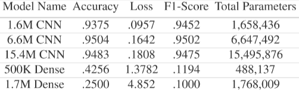

# Convolutional Neural Network to Classify Retinal OCT Images (Fall 2020)
## Objective
Optical Coherence Tomography is a Retinal imaging technique used to detect retinal abnormalities. However, the analysis of such images to reach aretinal diagnosis serves to be a difficult and time-consuming task for medical professionals. This project aims to develop the most efficient convolutional neural network model to classify these OCT images. This CNN is then benchmarked against a fully-connected neural network model to demonstrate a CNN's performance in tasks that require spatial context.

## Background
OCT is a retinal imaging technique which uses light waves and their reflections to build a cross-section of the eye. This cross-section image is used to look at the different layers of the retina and identify any signs of abnormalities to diagnose optical diseases. For the purposes of this project, we focused on 4 types of classifications – Choroidal Neovascularisation (CNV), Diabetic Macular Edema (DME), Drusen present in Age-related Macular Degeneration (DRUSEN), and a Normal Retina (NORMAL). Figure 1 depicts an OCT Image of each of these abnormalities, along with a normal retina for a comparison

## Models
Our models are constructed through Keras, a Python library used for deep learning. We experimented with different sets of layers and measured our model's effectiveness using accuracy, F1-score, and sparse categorical cross-entropy loss metrics. The models are compiled with their respective training sets to produce the required metrics.

## Online Demo
Demo: https://colab.research.google.com/github/ACM-Research/image-classification-cnn/blob/master/demo/RetinalOCTDemo.ipynb

Images to use: NORMAL.jpeg, CNV.jpeg, DRUSEN.jpeg, DME.jpeg

## Poster

